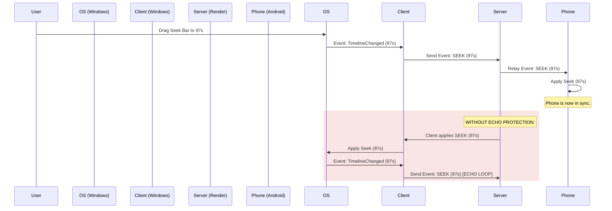

# Lumi Networking Architecture: From UDP to WebSocket Relay

This document provides a comprehensive, technical breakdown of the networking architecture utilized by Lumi to achieve real-time, low-latency media playback synchronization between Windows and Android devices.

---

## 1. Architectural Evolution

Lumi's networking layer went through two distinct phases to solve real-world network constraints:

### Phase A: Peer-to-Peer UDP Hole Punching (Deprecated)
* **Design:** Devices communicated directly with each other using UDP sockets. A central coordinator was only used as a STUN-like signaling server to exchange public endpoints (`IP:PORT`), after which clients attempted direct UDP hole punching.
* **Why it failed:** Restrictive institutional networks (such as university Wi-Fi networks like `amritanet.edu`) employ **Access Point (AP) Isolation** and block local/outbound UDP ports. This prevents direct peer-to-peer traffic and STUN traversal entirely, causing connections to fail.

### Phase B: WebSocket Relay over HTTPS/WSS (Current)
* **Design:** Both clients establish persistent outbound TCP connections to a public-facing coordinator server over **port 443 (HTTPS/WSS)**. 
* **Why it succeeds:** Port 443 is universally allowed by firewalls to permit web browsing. By routing all commands through a public relay, local firewall blocks, NAT boundaries, and AP isolation are bypassed.

```mermaid
graph TD
    subgraph Local Network (Restricted Wi-Fi / Mobile Data)
        A[Windows Client]
        B[Android Client]
    end
    subgraph Public Internet
        C[Render Web Service: Node.js Coordinator]
    end
    A -- Outbound TCP wss:// port 443 --> C
    B -- Outbound TCP wss:// port 443 --> C
    C -- Relays playback commands --> B
    C -- Relays playback commands --> A
```

---

## 2. The Coordinator Server (Node.js & Rust)

The coordinator is a lightweight, memory-efficient message broker. Its main jobs are managing rooms and routing payloads. It does not store media states; it only forwards messages.

### Room Management
* The coordinator maintains a thread-safe map of active rooms (`rooms` map).
* A room is represented as a list of connected client sockets: `Map<room_code, Set<WebSocket>>`.
* When a socket disconnects, the coordinator automatically cleans up and removes the client from its active room list.

---

## 3. Communication Protocol (JSON Schema)

All payloads sent over the WebSocket connection are serialized as JSON. There are three primary message types:

### A. Room Registration Frame
Sent immediately by the client upon establishing a connection.

```json
{
  "action": "join",
  "room": "456"
}
```
* **Coordinator Action:** Associates the connection socket with room `456`. Future messages from this client will be broadcasted to all other sockets in room `456`.

### B. Media Sync Event Frame
Sent whenever a user interacts with playback (play, pause, seek) or when the media player's timeline changes.

```json
{
  "type": "PLAY",
  "device_id": "windows-device-1",
  "event_id": "40b8a786-fbdf-45a8-b649-166f2c253ff5",
  "timestamp": 1723180000000,
  "position": 102.5,
  "playing": true
}
```
* **Event Types (`type`):**
  * `PLAY`: Resume playback.
  * `PAUSE`: Pause playback.
  * `SEEK`: Jump to a specific second marker.
* **Coordinator Action:** Broadcasts the payload exactly as-is to all other clients registered in the same room.

### C. Latency (Ping/Pong) Frame
Sent periodically every 10 seconds to estimate the network Round Trip Time (RTT).

```json
// Sent by Client:
{
  "action": "ping",
  "timestamp": 1723180050000
}

// Replied by Server immediately:
{
  "action": "pong",
  "timestamp": 1723180050000
}
```
* **Coordinator Action:** Intercepts the `ping` and returns the `pong` directly back to the sender without relaying it to other peers.

---

## 4. Deduplication & Loopback Prevention (Echo Protection)

A fundamental challenge of OS-integrated media sync is preventing **feedback echo loops**:



To break this loop, both clients implement a **Time-Windowed Suppression Filter**:

### Android Client Echo Suppression
* The client records the timestamp and event type of incoming network commands in `@Volatile` fields: `lastReceivedEventTime` and `lastReceivedEventType`.
* When the Android OS notifies the app that a local media session state changed, the client checks:
  $$\Delta t = T_{current} - T_{lastReceivedEvent}$$
* If $\Delta t < 2.0\text{ seconds}$ and the event type matches, the change is treated as an echo of the network command and is **discarded** instead of being sent back out.

### Windows Client Echo Suppression
* Similar to Android, the Windows client stores `last_network_event` as an `Arc<Mutex<Option<(Instant, EventType)>>>`.
* **Play/Pause deduplication:** Handled in the playback status changed callback.
* **Seek deduplication:** Handled in the `TimelineChanged` callback. When a timeline change jump exceeds $1.5\text{ seconds}$ (signaling a manual seek), it checks the time elapsed since the last network-driven `Seek`. If it is less than $2.0\text{ seconds}$, it suppresses the local seek and avoids broadcasting it back to the server.

---

## 5. Latency Measurement (RTT)

Measuring latency is crucial for high-fidelity sync. The RTT is calculated using the system clock:

$$RTT = T_{recv\_pong} - T_{sent\_ping}$$

1. **Client Send:** Client records the current system timestamp $T_{sent\_ping}$ and sends it inside a `ping` action.
2. **Server Reply:** The server returns the payload instantly.
3. **Client Receive:** Upon receiving the `pong`, the client reads the current time $T_{recv\_pong}$ and subtracts the original timestamp.

### Latency Visualization
* **Windows Client:** Logs the latency in the terminal: `[Network] RTT: 42 ms`.
* **Android Client:** Displays the real-time latency on the UI connection status card: `Connected (RTT: 45 ms)`.

This RTT can be halved ($RTT / 2$) to estimate the one-way transit delay and offset the media player's seek target, resulting in highly synchronized audio output.
